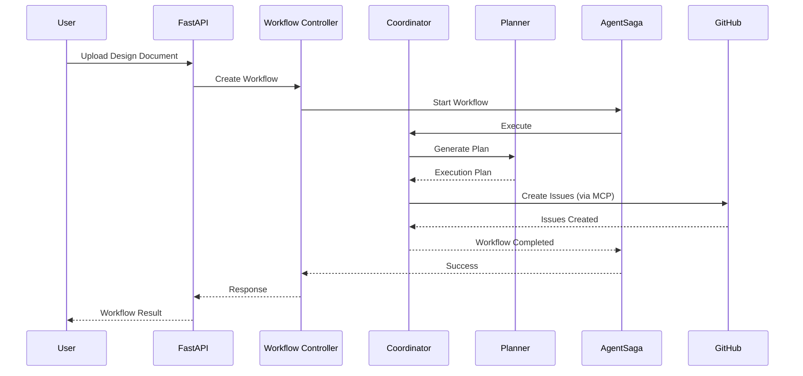
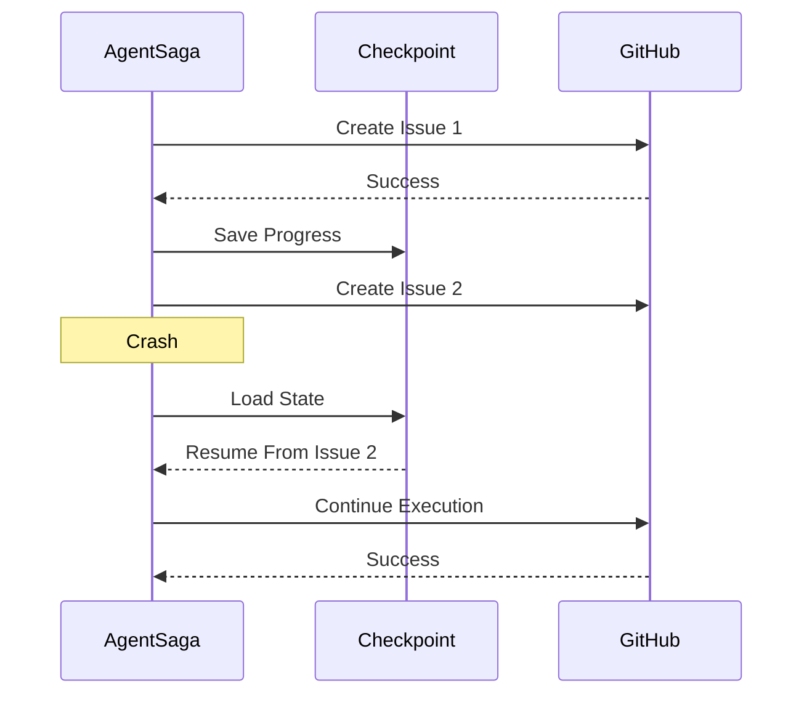

# Sequence Diagrams

## Sprint Planning Workflow

```mermaid
sequenceDiagram

participant User
participant API as FastAPI
participant WC as Workflow Controller
participant Coordinator
participant Planner
participant AgentSaga
participant GitHub

User->>API: Upload Design Document

API->>WC: Create Workflow

WC->>AgentSaga: Start Workflow

AgentSaga->>Coordinator: Execute

Coordinator->>Planner: Generate Plan

Planner-->>Coordinator: Execution Plan

Coordinator->>GitHub: Create Issues (via MCP)

GitHub-->>Coordinator: Issues Created

Coordinator-->>AgentSaga: Workflow Completed

AgentSaga-->>WC: Success

WC-->>API: Response

API-->>User: Workflow Result
```

---

## Crash Recovery

```mermaid
sequenceDiagram

participant AgentSaga
participant Checkpoint
participant GitHub

AgentSaga->>GitHub: Create Issue 1
GitHub-->>AgentSaga: Success

AgentSaga->>Checkpoint: Save Progress

AgentSaga->>GitHub: Create Issue 2

Note over AgentSaga: Crash

AgentSaga->>Checkpoint: Load State

Checkpoint-->>AgentSaga: Resume From Issue 2

AgentSaga->>GitHub: Continue Execution

GitHub-->>AgentSaga: Success
```